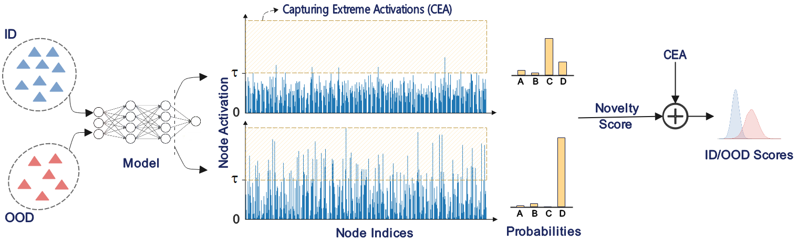

# CEA: Capturing Extreme Activations

This repository contains the code for the paper "**Mitigating Overconfidence in Out-of-Distribution Detection by Capturing Extreme Activations**", published at *40th Conference on Uncertainty in Artificial Intelligence (UAI)*. 

Out-of-distribution (OOD) inputs are commonly expected to cause a more uncertain prediction in the primary task; however, there are OOD cases for which the model returns a highly confident prediction. This phenomenon, denoted as "overconfidence", presents a challenge to OOD detection. In this work, we address this issue by measuring extreme activation values in the penultimate layer of neural networks and then leverage this proxy of overconfidence to improve on several OOD detection baselines. Compared to the baselines, our method often grants substantial improvements.

## Illustration
Overview of the proposed method (CEA). We measure the ℓ2-norm of extreme activation values larger than the threshold τ as an indicator of overconfidence caused by OOD samples and add it to the original novelty score computed based on the probabilities and activation values to generate the final novelty scores.
<p align="center">
  
</p>

## Running the Code

### Requirements
```
pip install -r requirements.txt
```

### Main code options
* `architecture`: Prediction model's architecture.
* `data_in_name`: Dataset employed as the  in-distribution set in the experiments.
* `ood_type`: Type of OOD samples in the experiments (from another dataset when eICU or MIMIC are ID, or synthesized by scaling a variable).
* `percentile_top`: $p$ in CEA
* `addition_coef`: $\gamma$ in CEA
* `seed`: Random seed in the experiments.

### Running command
```
python calling_codes.py --data_in_name diabetics --seed 1 --architecture MLP
```

## Acknowledgement
Part of this code is inspired by [TabMedOOD](https://github.com/mazizmalayeri/TabMedOOD/), [Trust Issues](https://github.com/Pacmed/ehr_ood_detection/), [Guidlines for Practical Evaluation](https://github.com/Giovannicina/selecting_OOD_detector), and [OpenOOD](https://github.com/Jingkang50/OpenOOD).

## Citation 
Please cite our work if you use the codebase: 
```
@article{
azizmalayeri2024mitigating,
title={Mitigating Overconfidence in Out-of-Distribution Detection by Capturing Extreme Activations},
author={Mohammad Azizmalayeri and Ameen Abu-Hanna and Giovanni Cin{\`a}},
booktitle={Proceedings of the Fortieth Conference on Uncertainty in Artificial Intelligence},
year={2024},
}
```
